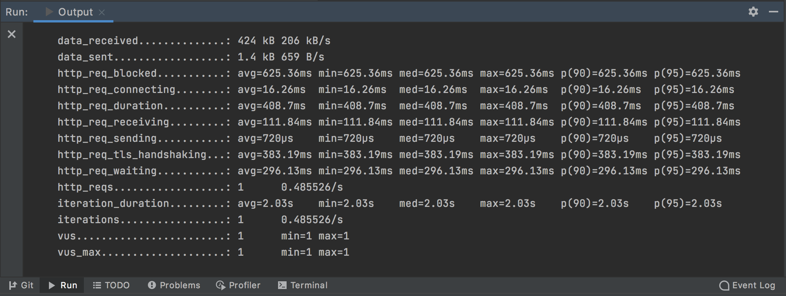
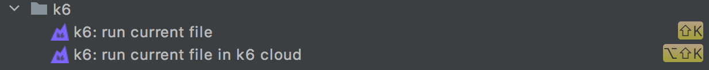
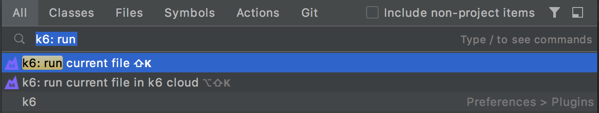
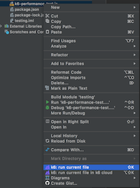
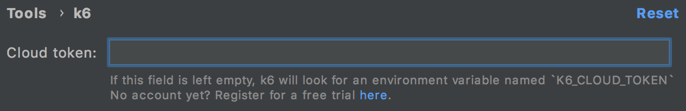

<!-- Plugin description -->

IntelliJ Plugin to run [k6 tests](https://k6.io/) locally or in the [k6 Cloud](https://k6.io/cloud) from your IntelliJ IDE. 



## Features

Run a k6 test using Keyboard Shortcuts. By default, `shift K`  for local tests, and `alt shift K` for cloud tests.



Run a k6 test from the Search Menu (`Double shift`).



Run a k6 test from the popup file menu. Select the test file, open the file options and click on the `k6: run current file` command.



For running cloud tests, you have to set your [k6 Cloud Token](https://app.k6.io/account/token) in `Settings/Preferences/Tools/k6`. 



<!-- Plugin description end -->

## Installation 

- In the Settings/Preferences dialog, select Plugins. 
- Use the Marketplace tab to find the k6 plugin. 
- Click install.
- Enjoy!

### Build plugin from the sources

```bash
./gradlew buildPlugin
````

Start IDE bundled with plugin via gradle:

```bash
./gradlew runIde
```                                            

